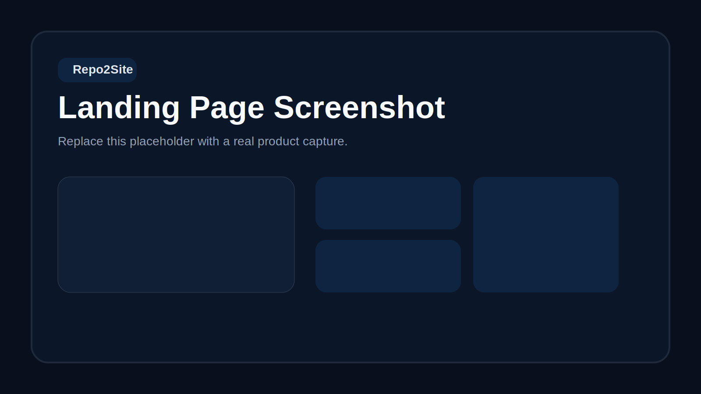
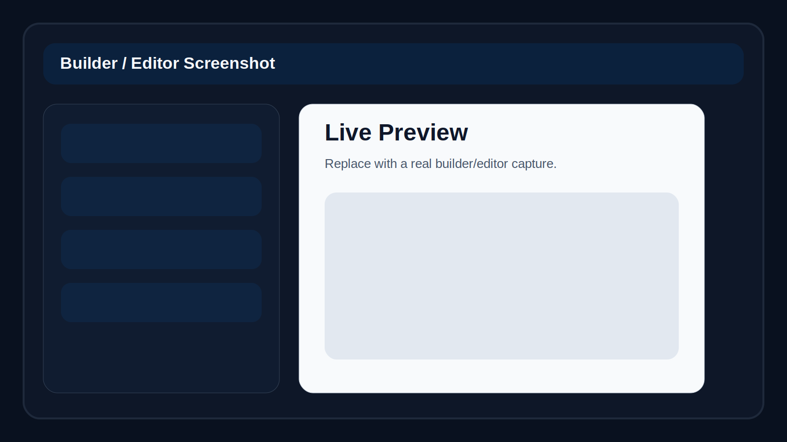
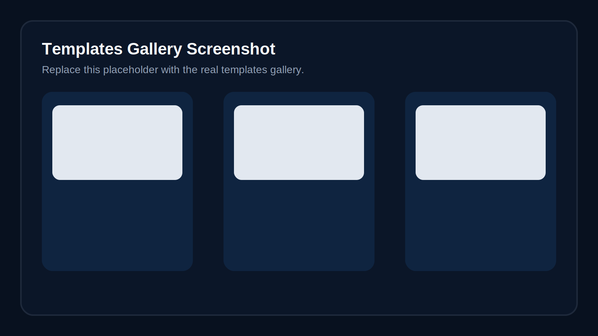

# Repo2Site


GitHub-first portfolio builder that turns public repositories, README context, and optional resume data into an editable portfolio site.





## Product Overview

Repo2Site helps developers start from real work instead of a blank portfolio template. The app imports a public GitHub profile, selects featured repositories, extracts README signals and images, optionally enriches the draft with resume or public profile sources, and then lets the user edit everything inside a live builder. The current builder is intentionally moving toward a calmer SaaS-editor model: lighter section chrome, fewer always-visible controls, progressive disclosure for actions, and cleaner content-first editing. Users can enhance copy with AI, remix community templates, publish a public share page, or export a static ZIP bundle.

This repository currently contains:

- a landing page at `/`
- a portfolio builder at `/builder`
- a template gallery at `/templates`
- public share pages at `/u/[slug]`
- Next.js API routes for import, enrichment, AI enhancement, export, sharing, templates, auth, and monitoring

## Features

- Public GitHub profile import using the GitHub REST API
- Featured repository selection, README excerpt extraction, and README image discovery
- Resume and public-profile enrichment from uploaded PDF files or public URLs
- Live client-side builder with editable copy, layout ordering, hidden sections, theme selection, palette changes, and density/layout controls
- Progressive-disclosure editor UI with quieter section controls, compact action menus, and reduced visual noise
- AI-assisted copy enhancement through the OpenAI Responses API
- Guided walkthrough with mobile-aware positioning, persistence, restart, and skip/resume behavior
- Static ZIP export for the final portfolio
- Public share publishing with Open Graph metadata and generated OG images
- Community template gallery with starter templates, remix tracking, likes/dislikes, and ratings
- GitHub OAuth-backed session support for publishing shares and templates
- Sentry-compatible client/server error forwarding
- Optional Plausible analytics script injection

## User Workflow

1. Open `/builder`.
2. Paste a public GitHub profile URL and generate a draft.
3. Optionally upload a PDF resume or cover letter, or import additional public profile URLs.
4. Review the live preview and edit text, links, profile details, and layout.
5. Optionally run AI enhancement suggestions and accept only the changes you want.
6. Open the customize drawer from the floating launcher and change theme, density, layout style, card treatment, and colors.
7. Reorder sections/projects and optionally remix a template from `/templates`.
8. Export a ZIP bundle or publish a public share page.

## Current Product Direction

Repo2Site is strongest when it behaves like a focused developer-portfolio operating system instead of a generic website builder.

What it already does well:

- turns GitHub work into a credible first draft quickly
- keeps editing inside a live preview instead of forcing users into disconnected forms
- separates content, presentation, and publishing cleanly
- supports multiple end states: export, hosted share page, and reusable templates

What the editor is optimizing for now:

- less clutter by default
- stronger content hierarchy
- progressive disclosure instead of always-visible controls
- cleaner section-level actions and optional fields
- faster scanning for first-time users

## Tech Stack

- Framework: Next.js App Router
- UI: React 19 + TypeScript
- Styling: Tailwind CSS
- Fonts: Manrope, JetBrains Mono via `next/font`
- Testing: Node test runner with `tsx`, Playwright
- AI: OpenAI Responses API
- Source data: GitHub REST API
- Auth: GitHub OAuth + signed HTTP-only session cookies
- Durable production storage: Upstash Redis REST
- Local development storage fallback: filesystem JSON under `.repo2site-data`
- Monitoring: Sentry envelope API
- Optional analytics: Plausible

## Architecture Summary

Repo2Site is a Next.js application with one large interactive client builder and a set of server routes/services behind it.

- `app/`
  App Router pages and API endpoints
- `components/`
  landing page, builder shell, walkthrough UI, template gallery, public share renderer
- `lib/`
  GitHub import, preview generation, portfolio composition, export generation, storage drivers, auth helpers, AI integration, monitoring, theming, and template systems
- `hooks/`
  walkthrough controller hook
- `tests/`
  route-level unit checks and Playwright smoke coverage

High-level flow:

1. `POST /api/generate` validates a GitHub URL and calls `generatePortfolioPreview(...)`.
2. `lib/preview-generator.ts` fetches GitHub profile + repositories, ranks featured repos, derives summaries/themes, and returns the initial draft.
3. `components/repo2site-shell.tsx` stores user overrides client-side and composes the editable portfolio view.
4. `POST /api/enrich` imports PDF/public sources into structured enrichment suggestions.
5. `POST /api/enhance` sends draft + overrides + enrichment data to OpenAI and returns suggested copy.
6. `buildFinalPortfolio(...)` resolves GitHub/AI/user content into a final portfolio model.
7. Export/share/template routes persist or render the final model through filesystem or Upstash-backed services.

## Installation and Setup

### Prerequisites

- Node.js
  The repository does not pin an `engines` field. Use a current Node.js version compatible with Next.js 16.
- npm

### Install

```bash
npm install
```

### Start development

```bash
npm run dev
```

Open [http://localhost:3000](http://localhost:3000).

## Environment Variables

### Core / required for full local functionality

- `OPENAI_API_KEY`
  Required for AI enhancement.
- `GITHUB_CLIENT_ID`
  Required for GitHub sign-in.
- `GITHUB_CLIENT_SECRET`
  Required for GitHub sign-in.
- `REPO2SITE_AUTH_SECRET`
  Required for signed production auth sessions.

### GitHub import

- `GITHUB_TOKEN` or `GITHUB_API_TOKEN`
  Optional but helpful to reduce GitHub API rate-limit issues during profile import.

### Share + template storage

- `REPO2SITE_SHARE_BACKEND`
  Use `upstash` to force the Upstash driver.
- `UPSTASH_REDIS_REST_URL`
  Required with `upstash`.
- `UPSTASH_REDIS_REST_TOKEN`
  Required with `upstash`.

Without Upstash, local development falls back to `.repo2site-data/shares` and `.repo2site-data/templates`.

### Site URLs / deployment

- `NEXT_PUBLIC_APP_URL`
  Canonical app origin and public-share origin.
- `REPO2SITE_RUNTIME_ENV`
  Optional override used by production runtime guards.

### Monitoring / analytics

- `SENTRY_DSN` or `NEXT_PUBLIC_SENTRY_DSN`
  Required by the production runtime guard.
- `NEXT_PUBLIC_PLAUSIBLE_DOMAIN`
  Optional Plausible domain.
- `NEXT_PUBLIC_PLAUSIBLE_SCRIPT_URL`
  Optional Plausible script URL override.

### Vercel-managed variables referenced by the code

- `VERCEL_ENV`
- `VERCEL_URL`
- `VERCEL_PROJECT_PRODUCTION_URL`
- `VERCEL_GIT_COMMIT_SHA`

## Run, Build, Test, Deploy

### Development

```bash
npm run dev
```

### Production build

```bash
npm run build
npm run start
```

### Unit tests

```bash
npm run test:unit
```

### End-to-end smoke tests

```bash
npm run test:e2e
```

Playwright starts the dev server automatically unless `PLAYWRIGHT_BASE_URL` is already set.

## Vercel / Deployment Notes

This project is clearly optimized for Vercel-style deployment:

- runtime guards check `VERCEL_ENV`
- site URL resolution uses `VERCEL_URL` and `VERCEL_PROJECT_PRODUCTION_URL`
- monitoring release tagging reads `VERCEL_GIT_COMMIT_SHA`
- public URLs and OG images assume a canonical deployed origin

There is no `vercel.json` in the repository, so deployment relies on standard Next.js defaults plus environment configuration.

Production guardrails in `lib/runtime-env.ts` fail fast if critical configuration is missing. In production, the app requires:

- `NEXT_PUBLIC_APP_URL`
- `SENTRY_DSN` or `NEXT_PUBLIC_SENTRY_DSN`
- `REPO2SITE_AUTH_SECRET`
- `GITHUB_CLIENT_ID`
- `GITHUB_CLIENT_SECRET`
- `REPO2SITE_SHARE_BACKEND=upstash`
- `UPSTASH_REDIS_REST_URL`
- `UPSTASH_REDIS_REST_TOKEN`

## Data / Service Dependencies

Repo2Site does not include a traditional database layer or ORM in this repository.

Actual data dependencies found in the implementation:

- GitHub REST API for profile/repository import
- OpenAI Responses API for AI enhancement
- Upstash Redis REST for durable production share/template storage
- Local filesystem JSON storage for local share/template development fallback
- GitHub OAuth for authenticated publishing actions
- Sentry for error reporting
- Plausible for optional analytics

## Folder Structure

```text
app/
  api/
    auth/
    enhance/
    enrich/
    export/
    generate/
    monitoring/
    share/
    templates/
  builder/
  templates/
  u/[slug]/
components/
hooks/
lib/
docs/
tests/
```

Useful files:

- [`components/repo2site-shell.tsx`](components/repo2site-shell.tsx)
  Main builder UI and editing workflow
- [`lib/preview-generator.ts`](lib/preview-generator.ts)
  GitHub import to preview generation pipeline
- [`lib/portfolio.ts`](lib/portfolio.ts)
  Final portfolio composition and override resolution
- [`lib/share-store.ts`](lib/share-store.ts)
  Public share persistence and slug logic

## What Repo2Site Can Become

The highest-upside version of Repo2Site is not "yet another portfolio site builder." It can become a developer identity platform with the builder as the core editing surface.

Plausible product expansions:

- portfolio operating system
  GitHub import, resume grounding, editable public profile, reusable themes, and one-click publishing
- application toolkit
  resume, cover letter, recruiter-facing links, and role-specific portfolio variants from the same source profile
- template marketplace
  higher-quality community templates, creator attribution, remix lineage, and curated theme systems
- developer brand layer
  speaking, writing, awards, open-source credibility, and public proof beyond repositories alone
- lightweight career CRM
  role-specific edits, private/public variants, share tracking, and application-ready exports

## Suggested Next Focus

If you want the product to feel sharper fast, focus next on:

1. editor completion and usability
   Finish simplifying the builder so section editing, menus, and optional fields feel consistent everywhere.
2. publish quality
   Make exported and shared portfolios feel more premium with stronger defaults, better empty states, and more polished responsive behavior.
3. template quality over template quantity
   A small set of excellent, distinct presets will do more for the product than a large gallery of similar ones.
4. role-based outcomes
   Help users produce different versions for internships, full-time roles, freelance work, or open-source visibility.
5. trust and conversion
   Add clearer onboarding, stronger examples, and better proof that the generated site is worth sharing publicly.
- [`lib/template-store.ts`](lib/template-store.ts)
  Community template persistence and engagement
- [`lib/static-export.ts`](lib/static-export.ts)
  Static ZIP bundle generation

## Docs

- [USER_MANUAL.md](USER_MANUAL.md)
- [DEVELOPER_MANUAL.md](DEVELOPER_MANUAL.md)
- [docs/share-service.md](docs/share-service.md)
- [docs/template-gallery.md](docs/template-gallery.md)
- [docs/production-runtime.md](docs/production-runtime.md)

## Limitations and Visible Future Improvements

These are visible from the current implementation:

- The builder is concentrated in a very large client component, which raises maintenance cost.
- There is no dedicated database migration/tooling layer in the repository; storage is service-driver based.
- Screenshot assets were not present in the repo, so placeholder docs assets were created and should be replaced with real captures.
- CI/CD workflow files are not present in the repository.
- GitHub import and enrichment depend on external sites remaining publicly accessible and unblocked.

## Placeholder Assets To Replace

The following placeholder assets were created for documentation and should be replaced with real branded captures when available:

- `docs/assets/repo2site-logo.svg`
- `docs/assets/repo2site-landing-screenshot.svg`
- `docs/assets/repo2site-builder-screenshot.svg`
- `docs/assets/repo2site-templates-screenshot.svg`
